<!-- ══════════════════════════════════════════════════════════
     HERO — Animated gradient header
══════════════════════════════════════════════════════════ -->
<div align="center">
  
  <h3>⚡ Engineering AI-Powered Products &nbsp;·&nbsp; Fullstack &amp; Mobile Native</h3>
</div>

<!-- Typing SVG -->
<p align="center">
  <a href="https://git.io/typing-svg">
    
  </a>
</p>

<!-- Badges row -->
<p align="center">
  <a href="https://www.linkedin.com/in/julian-david-gonzalez-bermudez">
    
  </a>
  <a href="https://github.com/jdgonzalezz2">
    
  </a>
  
  
  
</p>

<br/>

<!-- ══════════════════════════════════════════════════════════
     ABOUT ME — Split table layout
══════════════════════════════════════════════════════════ -->

<table width="100%">
<tr>
<td width="55%" valign="top">

## 🧭 About Me

Estudiante de Ing. Sistemas @ **Universidad de los Andes** (7mo semestre), construyendo en la intersección de **IA, Fullstack Web y Mobile Nativo**. Desarrollé un **psicólogo virtual con IA** en la Feria de Innovación Uniandes 2023, y co-lidero la ingeniería de **FocusFlow** — un planeador académico con IA con usuarios reales en producción.

Certificado por **Stanford** (Algorithms), **Meta** (Android UI) y **IELTS C1**, aporto rigor académico y entrega real a cada equipo en el que participo.

</td>
<td width="45%" valign="top">

```yaml
# juliandev.yaml
name:    "Julián David González Bermúdez"
role:    "Fullstack & Mobile Developer"
focus:   "AI-powered products + UX"
school:  "Uniandes · 7th semester"
certs:
  - "Stanford — Algorithms (4 courses)"
  - "Meta — Android UI Development"
  - "IELTS General Training — C1"
  - "Uniandes — Cybersecurity Spec."
open_to: ["internships", "collabs", "OSS"]
goal_2026: "Ship AI product to real market"
```

</td>
</tr>
</table>

<!-- Current focus collapsible -->
<details open>
<summary><b>📡 Radar actual</b></summary>
<br/>

```text
🔭  Building     →  FocusFlow   — AI academic planner (React · Node.js · Production)
🧠  Exploring    →  LLM integration · RAG · Cloud Architecture · System Design
🤝  Open to      →  Internships · Startup collabs · Open-source contributions
🏆  Goal 2026    →  Ship an AI product with real paying users
📍  Based in     →  Bogotá, Colombia   🇨🇴
🌎  Languages    →  Spanish (native)  ·  English C1 (IELTS certified)
```

</details>

<br/>

<!-- ══════════════════════════════════════════════════════════
     TECH ARSENAL
══════════════════════════════════════════════════════════ -->

## 🛠️ Tech Arsenal

<div align="center">

<table>
<tr>
<td align="center" width="50%">

**Frontend & Design**


</td>
<td align="center" width="50%">

**Backend & Cloud**


</td>
</tr>
<tr>
<td align="center" width="50%">

**Mobile Native**


</td>
<td align="center" width="50%">

**Currently learning**


</td>
</tr>
</table>

</div>

<br/>

<!-- ══════════════════════════════════════════════════════════
     FEATURED WORK
══════════════════════════════════════════════════════════ -->

## 🚀 Featured Work

<table width="100%">
<tr>
<td width="50%" valign="top">

### 🤖 Psicólogo Virtual con IA
**Feria de Innovación · Uniandes 2023**

Asistente conversacional de salud mental impulsado por IA. Combina **NLP** con flujos UX empáticos, diseñado para reducir la barrera de acceso a primeros auxilios psicológicos. Presentado en la Feria de Innovación de Uniandes 2023 con recepción positiva del jurado y usuarios.


</td>
<td width="50%" valign="top">

### 🎯 FocusFlow
**AI-Powered Academic Planner · In Production**

Planeador de estudio con IA, gestión de documentos académicos y sincronización con Google Calendar. Desplegado en Vercel con usuarios activos.


🔗 [**Demo en vivo**](https://focusflow-landing-page.vercel.app) · [Frontend](https://github.com/PMC-grupo7/FocusflowFrontend) · [Backend](https://github.com/PMC-grupo7/FocusflowBackend)

</td>
</tr>
<tr>
<td colspan="2" valign="top">

### 🏅 UniAndes Sports
**Native Android · Full Firebase Stack · Production Architecture**

App Android nativa con UI en **Jetpack Compose** y arquitectura **MVVM** estricta. Stack completo de Firebase: Auth, Firestore, Cloud Storage, Analytics y Crashlytics. Notificaciones push en tiempo real para actualizaciones de contenido deportivo.


💻 [Repositorio](https://github.com/MOVILES-Sec1-G17-ISIS3510/uniandesSports-Kotlin)

</td>
</tr>
</table>

<!-- Pinned repo cards -->
<div align="center">
  <a href="https://github.com/PMC-grupo7/FocusflowFrontend">
    
  </a>&nbsp;
  <a href="https://github.com/MOVILES-Sec1-G17-ISIS3510/uniandesSports-Kotlin">
    
  </a>
</div>

<br/>

<!-- ══════════════════════════════════════════════════════════
     GITHUB STATS — Triple card layout
══════════════════════════════════════════════════════════ -->

## 📊 GitHub Impact

<div align="center">
  
  
</div>

<div align="center">
  
</div>

<br/>

<!-- ══════════════════════════════════════════════════════════
     ACTIVITY GRAPH — Full width, area fill
══════════════════════════════════════════════════════════ -->

<div align="center">
  
</div>

<br/>

<!-- ══════════════════════════════════════════════════════════
     SNAKE — Auto-generated contribution animation
══════════════════════════════════════════════════════════ -->

<div align="center">
  <picture>
    <source media="(prefers-color-scheme: dark)"  srcset="https://raw.githubusercontent.com/jdgonzalezz2/jdgonzalezz2/output/github-snake-dark.svg"/>
    <source media="(prefers-color-scheme: light)" srcset="https://raw.githubusercontent.com/jdgonzalezz2/jdgonzalezz2/output/github-snake.svg"/>
    
  </picture>
</div>

<br/>

<!-- ══════════════════════════════════════════════════════════
     TROPHIES
══════════════════════════════════════════════════════════ -->

## 🏆 Trophies

<div align="center">
  
</div>

<br/>

<!-- ══════════════════════════════════════════════════════════
     CERTIFICATIONS — Executive table
══════════════════════════════════════════════════════════ -->

## 📜 Certifications

<div align="center">

| &nbsp; | Certification | Institution | Year |
|:---:|:---|:---|:---:|
| 🔒 | Cybersecurity Specialization | Universidad de los Andes | 2024 |
| 🤖 | Meta Android UI Development | Meta | 2024 |
| 🧮 | Algorithms Specialization — 4 courses | Stanford University | 2023 |
| 🌎 | IELTS General Training — Band 7+ (C1) | British Council / IELTS | 2023 |

</div>

<br/>

<!-- ══════════════════════════════════════════════════════════
     QUOTE OF THE DAY
══════════════════════════════════════════════════════════ -->

<div align="center">
  
</div>

<br/>

<!-- ══════════════════════════════════════════════════════════
     FOOTER
══════════════════════════════════════════════════════════ -->

<p align="center">
  <a href="https://www.linkedin.com/in/julian-david-gonzalez-bermudez">
    
  </a>
</p>

<div align="center">
  
</div>
